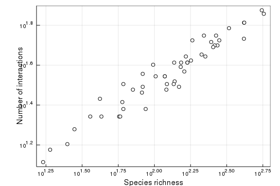

# Counting objects and paging

The goal of this vignette is to see how we can *count* objects, *i.e.* get the
number of entries in the database, and how we can then use this information to
*page* through the objects, *i.e.* download all of the matching records. To
illustrate, we will use a simple use case: plotting the relationship between
number of species and number of links in a number of food webs.

````julia
using Mangal
using Plots
````


## Counting and querying

Each type in **Mangal** has its own `count` method, which can be called without
any argument to return the total number of entries in the database. For example,
the total number of networks is:

````julia
count(MangalNetwork)
````


````
1386
````


We can also pass queries to the `count` methods. One of the most general way to
query things is to use `"q"`, which will look for a match in all text fields for
the type. In this use case, we want to retrieve the dataset corresponding to
Karl Havens' classical studies about food web scaling, so we can look for the
datasets with the string `"havens"` in them:

````julia
Havens_data = first(datasets("q" => "havens"))
````


````
MangalDataset(15, true, "havens_1992", 1984-06-01T04:00:00, 2019-02-23T01:4
7:06, 2019-02-23T01:47:06, MangalReference(15, 1992, "10.1126/science.257.5
073.1107", missing, missing, "@article{Havens_1992, doi = {10.1126/science.
257.5073.1107}, url = {https://doi.org/10.1126%2Fscience.257.5073.1107}, ye
ar = 1992, month = {aug}, publisher = {American Association for the Advance
ment of Science ({AAAS})}, volume = {257}, number = {5073}, pages = {1107--
1109}, author = {K. Havens}, title = {Scale and Structure in Natural Food W
ebs}, journal = {Science}}", "https://doi.org/10.1126%2Fscience.257.5073.11
07", "URL of the attached data"), 3, "Pelagic communities of small lakes an
d ponds of the Adirondack")
````


This information can be used to only count the number of networks that belong to
this dataset:

````julia
count(MangalNetwork, "dataset_id" => Havens_data.id)
````


````
50
````


Note that for convenience, there is a `count` method that will accept a
`MangalDataset` object to return the number of networks in this dataset. As you
may assume, it does nothing more internally than what we did at the step above.

````julia
Havens_count = count(MangalNetwork, Havens_data)
````


````
50
````


## Paging

Paging refers to retrieving multiple records from the database. It is regulated
by two parameters: `"count"`, the number of records to return *per* page
(default: `100`), and `"page"`, the page number (starting at 0). In this
example, we will return 10 objects per page, and so we will need to loop through
multiple pages:

````julia
Havens_networks = networks(Havens_data, "count" => 10)
page = 0
while length(Havens_networks) < Havens_count
  global page = page + 1
  append!(Havens_networks, networks(Havens_data, "page" => page, "count" => 10))
end
````


## Producing the plot

Finally, we can use additional `count` methods to get the number of nodes
(species) and interactions within each network, to procude the figure:

````julia
LS = [(count(MangalInteraction, n), count(MangalNode, n)) for n in Havens_networks]
scatter(LS, c=:white, leg=false, frame=:box)
xaxis!(:log, "Species richness")
yaxis!(:log, "Number of interactions")
````



