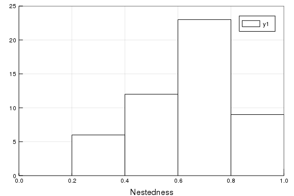

# Integration with `EcologicalNetworks.jl`

The **Mangal** package is integrated with **EcologicalNetworks** for analysis.

````julia
using Mangal
using EcologicalNetworks
````


## A simple example

In this simple example, we will look at a food web from 1956, retrieve it from
the Mangal database, then convert it into a usable object:

````julia
db_version = network("johnston_1956_19560101_947");
db_version.description
````


````
"Predation by short-eared owls on a salicornia salt marsh"
````


The conversion to the network is done using the `convert` method, which by
default will return a `UnipartiteNetwork`, where species are the `MangalNode` of
the original network:

````julia
N = convert(UnipartiteNetwork, db_version)
````


````
19×19 unipartite  ecological network (Bool, MangalNode) (L: 58)
````


We can check that the type of the network is correct:

````julia
eltype(N)
````


````
(Bool, MangalNode)
````


We can also confirm that all interactions and node counts match:

````julia
count(MangalInteraction, db_version) == links(N)
````


````
true
````


````julia
count(MangalNode, db_version) == richness(N)
````


````
true
````


## A more complex example

In this

````julia
hp_dataset = dataset("hadfield_2014");
hp_networks = networks(hp_dataset);
````


The next step might take a minute or two, but will consist in downloading every
information related to the network, and converting it into one
`UnipartiteNetwork` for every network in the dataset.

````julia
N = [convert(UnipartiteNetwork, n) for n in hp_networks];
````


````julia
B = [convert(BipartiteNetwork, n) for n in N];
````


````julia
using Plots
histogram(η.(B), frame=:box)
xaxis!("Nestedness", (0,1))
yaxis!("", (0, 25))
````



